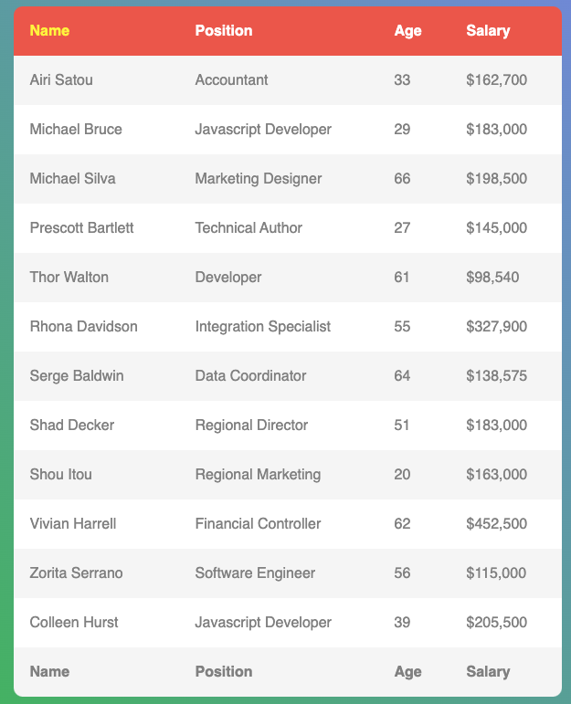

1. Replace `<your_account>` with your Github username in the link
    - [DEMO LINK](https://aliceblunt8.github.io/js_sort_table_DOM/)
2. Follow [this instructions](https://mate-academy.github.io/layout_task-guideline/)
    - There are no tests for this task so use `npm run lint` command instead of `npm test` 

### Task: Sort of employees table

Hi! In previous tasks, you already implemented table sort by salary. Today task is the same but with using browser events.

Your task: Implement table sorting in ASC order, by clicking on table headers. 

As always, all the necessary styles have already been written for you, you do not need to change the layout or styles in this task.

Start table:

##### Implement table sorting by clicking on the title
- Clicking on one of the table headers should sort the table rows in ASC order.

